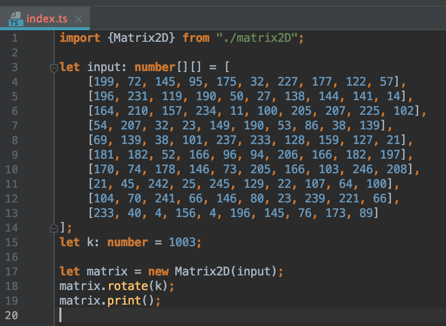
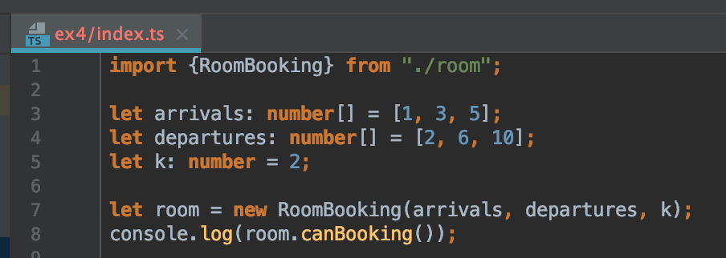

# Installation

1. Clone the repository
2. Run command line to install dependencies

```bash
$ npm install
```

# Rotate picture

Change the input data in ex1/index.ts file



Then run command line below, the result will be displayed in the log console

```bash
$ npm run ex1
```

Or for running unit tests, change input data in ex1/matrix.spec.ts. Then run:

```bash
$ npm run test1
```

# Hotel Reservation

Change the input data in ex4/index.ts file



Then run command line below, the result will be displayed in the log console

```bash
$ npm run ex4
```

Or for running unit tests, change input data in ex4/room.spec.ts. Then run:

```bash
$ npm run test4
```
